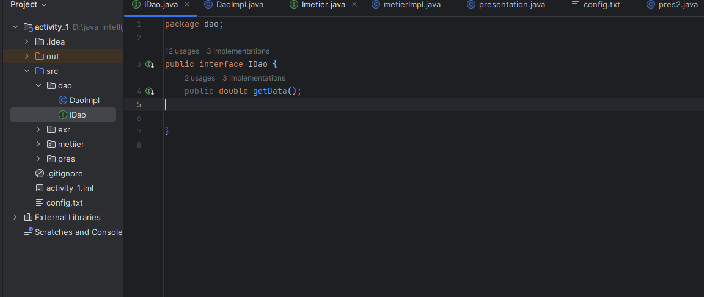
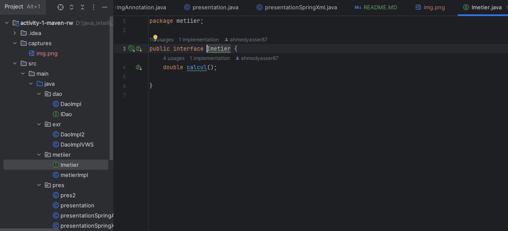
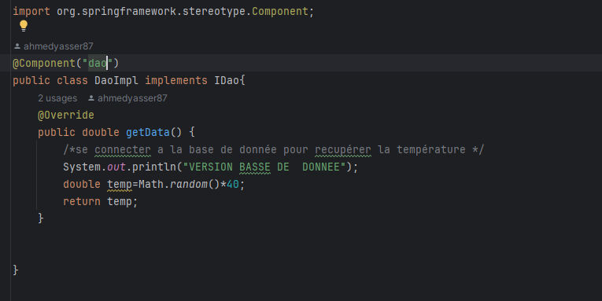
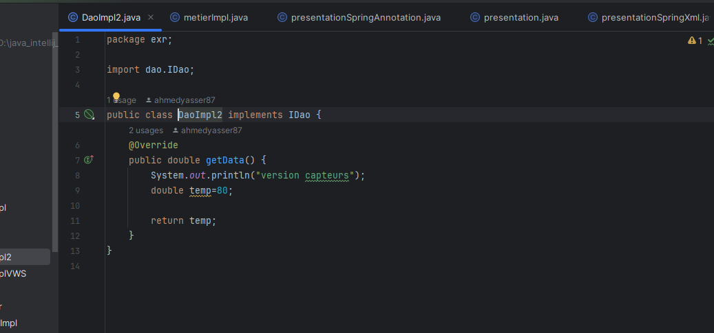
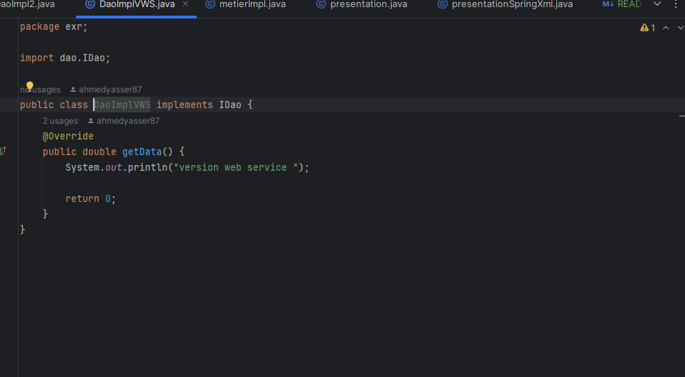
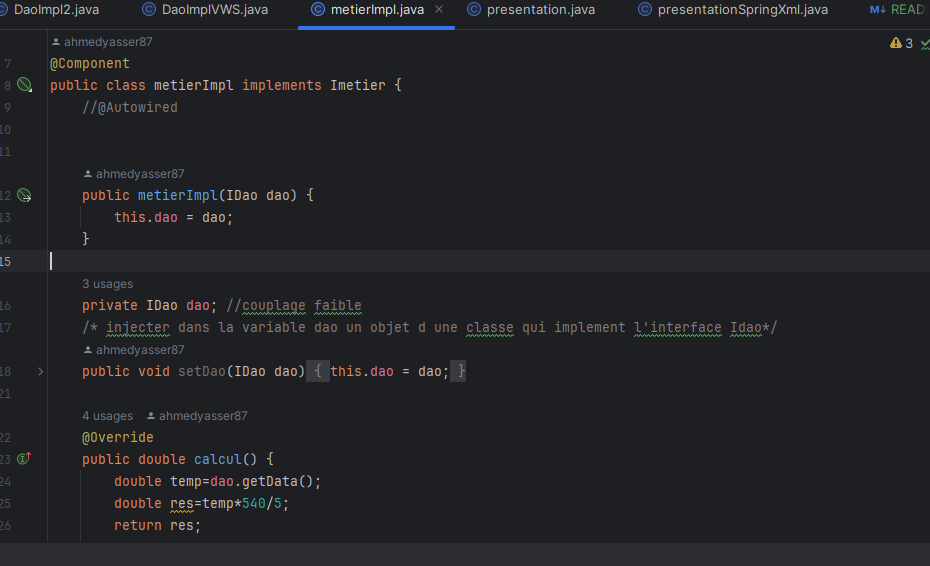
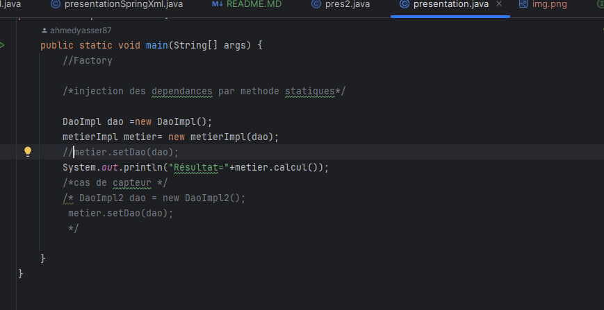
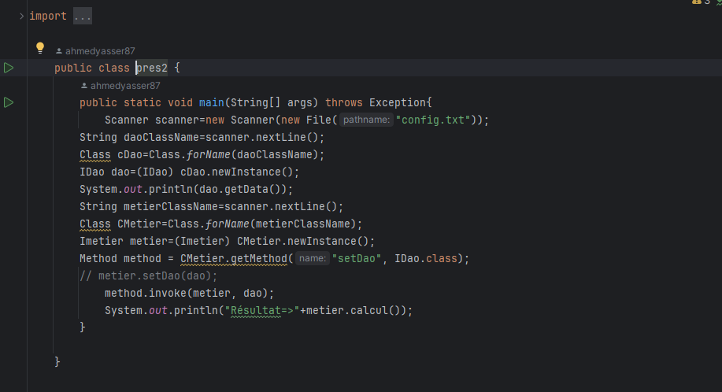
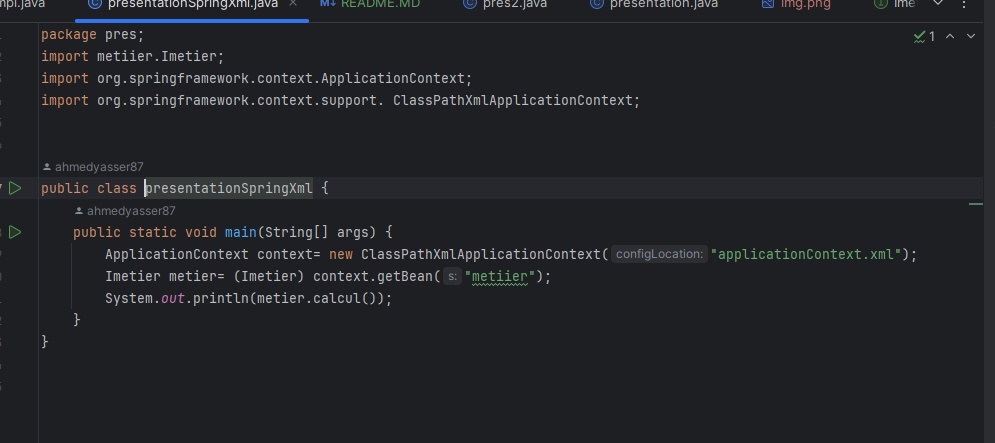
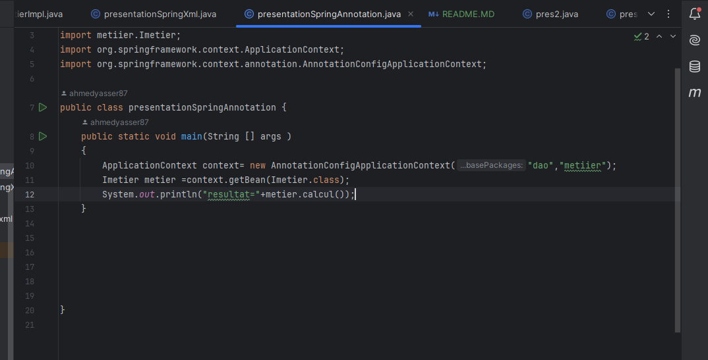

<h3>compte rendu<h3>
<h5>les captures des interfaces </h5>

<h5>les implementations d interfaces</h5>

<h5>injection des dependances</h5>

<h5> Version XML</h5>

<h5> Version annotations</h5>

